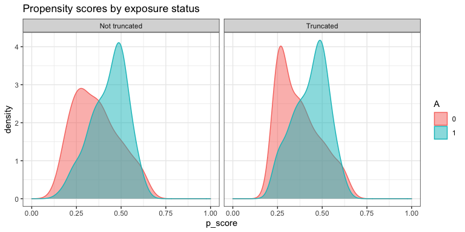
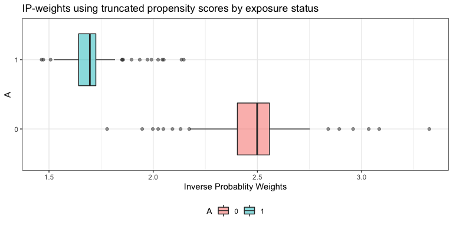

AIPW: Augmented Inverse Probability Weighting
================

<!-- badges: start -->

[](https://www.repostatus.org/#active)
[](https://codecov.io/gh/yqzhong7/AIPW?branch=master)
[](https://travis-ci.com/yqzhong7/AIPW)
[](https://github.com/yqzhong7/AIPW/actions)

<!-- badges: end -->
<!-- README.md is generated from README.Rmd. Please edit that file -->

**Contributors:** [Yongqi Zhong](https://github.com/yqzhong7), [Ashley
Naimi](https://github.com/ainaimi), [Gabriel
Conzuelo](https://github.com/gconzuelo), [Edward
Kennedy](https://github.com/ehkennedy)

------------------------------------------------------------------------

Augmented inverse probability weighting (AIPW) is a doubly robust
estimator for causal inference. The `AIPW` package is designed for
estimating the average treatment effect of a binary exposure on risk
difference (RD), risk ratio (RR) and odds ratio (OR) scales with
user-defined stacked machine learning algorithms
([SuperLearner](https://CRAN.R-project.org/package=SuperLearner) or
[sl3](https://tlverse.org/sl3/index.html)). Users need to examine causal
assumptions (e.g., consistency) before using this package.

If you find this package is helpful, please consider to cite:

    @article{zhong_aipw_2021,
      author = "Zhong, Y., Kennedy, E.H., Bodnar, L.M., Naimi, A.I. ",
      title = "AIPW: An R Package for Augmented Inverse Probability Weighted Estimation of Average Causal Effects",
      year = {2021},
      note = "In Press",
      journal = "American Journal of Epidemiology"
    }

**\* CRAN version only supports SuperLearner and tmle. Please install
the Github version (master branch) to use sl3 and tmle3.**

------------------------------------------------------------------------

## Contents:

-   ##### [Installation](#Installation)

-   ##### [Example](#Example)

    -   ###### [Setup example data](#data)

    -   ###### [One line version](#one_line)

-   ##### [Parallelization and progress bar](#par)

-   ##### [Use tmle/tmle3 as input](#tmle)

-   ##### [References](#ref)

------------------------------------------------------------------------

## <a id="Installation"></a>Installation

``` r
install.packages("remotes")
remotes::install_github("yqzhong7/AIPW")
```

## <a id="Example"></a>Example

### <a id="data"></a>Setup example data

``` r
set.seed(888)
data("eager_sim_obs")
outcome <- eager_sim_obs$sim_A
exposure <- eager_sim_obs$sim_Y
#covariates for both outcome model (Q) and exposure model (g)
covariates <- as.matrix(eager_sim_obs[-1:-2])

# covariates <- c(rbinom(N,1,0.4)) #a vector of a single covariate is also supported
```

### <a id="one_line"></a>One line version (`AIPW` class: method chaining from R6class)

``` r
library(AIPW)
library(SuperLearner)
#> Loading required package: nnls
#> Super Learner
#> Version: 2.0-26
#> Package created on 2019-10-27
library(ggplot2)
AIPW_SL <- AIPW$new(Y = outcome,
                    A = exposure,
                    W = covariates, 
                    Q.SL.library = c("SL.mean","SL.glm"),
                    g.SL.library = c("SL.mean","SL.glm"),
                    k_split = 3,
                    verbose=FALSE)$
  fit()$
  #Default truncation is set to 0.025; using 0.25 here is for illustrative purposes and not recommended
  summary(g.bound = 0.25)$ 
  plot.p_score()$
  plot.ip_weights()
```

<!-- --><!-- -->

To see the results, set `verbose = TRUE`(default) or:

``` r
print(AIPW_SL$result, digits = 2)
#>                  Estimate    SE 95% LCL 95% UCL   N
#> Risk of exposure     0.68 0.053  0.5765    0.78  78
#> Risk of control      0.54 0.046  0.4458    0.63 122
#> Risk Difference      0.14 0.070  0.0059    0.28 200
#> Risk Ratio           1.27 0.116  1.0099    1.59 200
#> Odds Ratio           1.84 0.307  1.0084    3.36 200
```

To obtain average treatment effect among the treated/controls (ATT/ATC),
`statified_fit()` must be used:

``` r
AIPW_SL_att <- AIPW$new(Y = outcome,
                    A = exposure,
                    W = covariates, 
                    Q.SL.library = c("SL.mean","SL.glm"),
                    g.SL.library = c("SL.mean","SL.glm"),
                    k_split = 3,
                    verbose=T)
suppressWarnings({
  AIPW_SL_att$stratified_fit()$summary()
})
#> Done!
#>                     Estimate     SE  95% LCL 95% UCL   N
#> Risk of exposure       0.672 0.0555  0.56310   0.781  78
#> Risk of control        0.546 0.0462  0.45537   0.637 122
#> Risk Difference        0.126 0.0724 -0.01581   0.268 200
#> Risk Ratio             1.231 0.1187  0.97537   1.553 200
#> Odds Ratio             1.704 0.3144  0.91994   3.155 200
#> ATT Risk Difference    0.125 0.0624  0.00262   0.247 200
#> ATC Risk Difference    0.121 0.1058 -0.08662   0.328 200
```

You can also use the `aipw_wrapper()` to wrap `new()`, `fit()` and
`summary()` together (also support method chaining):

``` r
AIPW_SL <- aipw_wrapper(Y = outcome,
                        A = exposure,
                        W = covariates, 
                        Q.SL.library = c("SL.mean","SL.glm"),
                        g.SL.library = c("SL.mean","SL.glm"),
                        k_split = 3,
                        verbose=TRUE,
                        stratified_fit=F)$plot.p_score()$plot.ip_weights()
```

## <a id="par"></a>Parallelization with `future.apply` and progress bar with `progressr`

In default setting, the `AIPW$fit()` method will be run sequentially.
The current version of AIPW package supports parallel processing
implemented by
[future.apply](https://github.com/HenrikBengtsson/future.apply) package
under the [future](https://github.com/HenrikBengtsson/future) framework.
Simply use `future::plan()` to enable parallelization and `set.seed()`
to take care of the random number generation (RNG) problem:

``` r
###Additional steps for parallel processing###
# install.packages("future.apply")
library(future.apply)
#> Loading required package: future
future::plan(multiprocess, workers=2, gc=T)
#> Warning: [ONE-TIME WARNING] Forked processing ('multicore') is disabled
#> in future (>= 1.13.0) when running R from RStudio, because it is
#> considered unstable. Because of this, plan("multicore") will fall
#> back to plan("sequential"), and plan("multiprocess") will fall back to
#> plan("multisession") - not plan("multicore") as in the past. For more details,
#> how to control forked processing or not, and how to silence this warning in
#> future R sessions, see ?future::supportsMulticore
set.seed(888)

###Same procedure for AIPW as described above###
AIPW_SL <- AIPW$new(Y = outcome,
                    A = exposure,
                    W = covariates, 
                    Q.SL.library = c("SL.mean","SL.glm"),
                    g.SL.library = c("SL.mean","SL.glm"),
                    k_split = 3,
                    verbose=TRUE)$fit()$summary()
#> Done!
#>                  Estimate     SE  95% LCL 95% UCL   N
#> Risk of exposure    0.676 0.0546  0.56913   0.783  78
#> Risk of control     0.538 0.0462  0.44705   0.628 122
#> Risk Difference     0.139 0.0714 -0.00144   0.279 200
#> Risk Ratio          1.258 0.1177  0.99869   1.584 200
#> Odds Ratio          1.796 0.3104  0.97745   3.300 200
```

Progress bar that supports parallel processing is available in the
`AIPW$fit()` method through the API from
[progressr](https://github.com/HenrikBengtsson/progressr) package:

``` r
library(progressr)
#define the type of progress bar
handlers("progress")
#reporting through progressr::with_progress() which is embedded in the AIPW$fit() method
with_progress(
  AIPW_SL <- AIPW$new(Y = outcome,
                    A = exposure,
                    W = covariates, 
                    Q.SL.library = c("SL.mean","SL.glm"),
                    g.SL.library = c("SL.mean","SL.glm"),
                    k_split = 3,
                    verbose=FALSE)$fit()$summary()
)
#also available for the wrapper
with_progress(
  AIPW_SL <- aipw_wrapper(Y = outcome,
                        A = exposure,
                        W = covariates, 
                        Q.SL.library = c("SL.mean","SL.glm"),
                        g.SL.library = c("SL.mean","SL.glm"),
                        k_split = 3,
                        verbose=FALSE)
)
```

## <a id="tmle"></a>Use `tmle` fitted object as input (`AIPW_tmle` class)

`AIPW_tmle` class is designed for using `tmle` fitted object as input

#### `tmle`

``` r
require(tmle)
#> Loading required package: tmle
#> Loading required package: glmnet
#> Loading required package: Matrix
#> Loaded glmnet 4.0
#> Welcome to the tmle package, version 1.4.0.1
#> 
#> Use tmleNews() to see details on changes and bug fixes
require(SuperLearner)
tmle_fit <- tmle(Y = outcome, A = exposure,W = covariates,
                 Q.SL.library=c("SL.mean","SL.glm"),
                 g.SL.library=c("SL.mean","SL.glm"),
                 family="binomial")
tmle_fit
#>  Additive Effect
#>    Parameter Estimate:  0.14389
#>    Estimated Variance:  0.0048764
#>               p-value:  0.039348
#>     95% Conf Interval: (0.0070199, 0.28076) 
#> 
#>  Additive Effect among the Treated
#>    Parameter Estimate:  0.14419
#>    Estimated Variance:  0.0048673
#>               p-value:  0.038752
#>     95% Conf Interval: (0.0074516, 0.28093) 
#> 
#>  Additive Effect among the Controls
#>    Parameter Estimate:  0.14318
#>    Estimated Variance:  0.0048874
#>               p-value:  0.040552
#>     95% Conf Interval: (0.0061575, 0.2802) 
#> 
#>  Relative Risk
#>    Parameter Estimate:  1.2696
#>               p-value:  0.039067
#>     95% Conf Interval: (1.012, 1.5927) 
#> 
#>               log(RR):  0.23871
#>     variance(log(RR)):  0.013383 
#> 
#>  Odds Ratio
#>    Parameter Estimate:  1.8362
#>               p-value:  0.045369
#>     95% Conf Interval: (1.0126, 3.3297) 
#> 
#>               log(OR):  0.6077
#>     variance(log(OR)):  0.092213
#extract fitted tmle object to AIPW
AIPW_tmle$
  new(A=exposure,Y=outcome,tmle_fit = tmle_fit,verbose = TRUE)$
  summary(g.bound=0.025)
#> Cross-fitting is supported only within the outcome model from a fitted tmle object (with cvQinit = TRUE)
#>                  Estimate     SE 95% LCL 95% UCL   N
#> Risk of exposure    0.678 0.0529 0.57380   0.781  78
#> Risk of control     0.534 0.0455 0.44450   0.623 122
#> Risk Difference     0.144 0.0698 0.00702   0.281 200
#> Risk Ratio          1.270 0.1157 1.01198   1.593 200
#> Odds Ratio          1.836 0.3037 1.01244   3.330 200
```

------------------------------------------------------------------------

### <a id="ref"></a>References:

Robins JM, Rotnitzky A (1995). Semiparametric efficiency in multivariate
regression models with missing data. Journal of the American Statistical
Association.

Chernozhukov V, Chetverikov V, Demirer M, et al (2018). Double/debiased
machine learning for treatment and structural parameters. The
Econometrics Journal.

Kennedy EH, Sjolander A, Small DS (2015). Semiparametric causal
inference in matched cohort studies. Biometrika.

Pearl, J., 2009. Causality. Cambridge university press.
