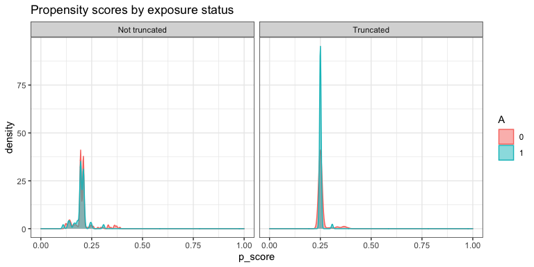

AIPW: Augmented Inverse Probability Weighting
================

<!-- badges: start -->

[](https://codecov.io/gh/yqzhong7/AIPW?branch=master)
[](https://travis-ci.com/yqzhong7/AIPW)
[](https://www.repostatus.org/#WIP)
[](https://github.com/yqzhong7/AIPW/actions)
<!-- badges: end -->

<!-- README.md is generated from README.Rmd. Please edit that file -->

**Authors:** [Yongqi Zhong](https://github.com/yqzhong7), [Ashley
Naimi](https://github.com/ainaimi), [Gabriel
Conzuelo](https://github.com/gconzuelo)

## Contents:

  - ##### [Installation](#Installation)

  - ##### [Example](#Example)
    
      - ###### [Setup example data](#data)
    
      - ###### [One line version](#one_line)
    
      - ###### [Longer version](#details)
        
        1.  [Create an AIPW object](#constructor)
        2.  [Fit the object](#fit)
        3.  [Calculate average treatment effects](#ate)
        4.  [Parallelization](#par)

-----

## <a id="Installation"></a>Installation

``` r
install.packages("remotes")
remotes::install_github("yqzhong7/AIPW")
```

## <a id="Example"></a>Example

### <a id="data"></a>Setup example data

``` r
set.seed(888)
N <- 200
outcome <- rbinom(N,1,0.3)
exposure <- rbinom(N,1,0.2)
#covaraites for outcome model (Q)
covariates.Q <- matrix(c(rbinom(N,1,0.4),
                                rnorm(N,mean = 0,sd=1),
                                rpois(N,lambda = 2)),
                              ncol=3)
#covariates for exposure model (g)
covariates.g <- matrix(c(rbinom(N,1,0.4),
                                rnorm(N,mean = 0,sd=1),
                                rpois(N,lambda = 2)),
                              ncol=3)

# covariates.g <- c(rbinom(N,1,0.4)) #a vector of a single covariate is also supported
```

### <a id="one_line"></a>One line version (Method chaining from R6class)

``` r
library(AIPW)
library(SuperLearner)
#> Loading required package: nnls
#> Super Learner
#> Version: 2.0-26
#> Package created on 2019-10-27
library(ggplot2)
library(progressr) #for the progress bar
AIPW_SL <- AIPW$new(Y= outcome,
                    A= exposure,
                    W.Q=covariates.Q, 
                    W.g=covariates.g,
                    Q.SL.library = c("SL.mean","SL.glm"),
                    g.SL.library = c("SL.mean","SL.glm"),
                    k_split = 3,
                    verbose=FALSE)$
  fit()$
  calculate_result(g.bound = 0.25)$
  plot.p_score()
```

<!-- -->

### <a id="details"></a>A slightly longer version

#### 1\. <a id="constructor"></a>Create an AIPW object

  - ##### Use [SuperLearner](https://cran.r-project.org/web/packages/SuperLearner/index.html) libraries (reference: [Guide to SuperLearner](https://cran.r-project.org/web/packages/SuperLearner/vignettes/Guide-to-SuperLearner.html))

<!-- end list -->

``` r
library(AIPW)
library(SuperLearner)

#SuperLearner libraries for outcome (Q) and exposure models (g)
sl.lib <- c("SL.mean","SL.glm")

#construct an aipw object for later estimations 
AIPW_SL <- AIPW$new(Y= outcome,
                    A= exposure,
                    W.Q=covariates.Q, 
                    W.g=covariates.g,
                    Q.SL.library = sl.lib,
                    g.SL.library = sl.lib,
                    k_split = 3,
                    verbose=FALSE)
```

  - ##### Use [sl3](https://tlverse.org/sl3/index.html) libraries (reference: [Intro to sl3](https://tlverse.org/sl3/articles/intro_sl3.html))

<!-- end list -->

``` r
library(AIPW)
library(sl3)

##construct sl3 learners for outcome (Q) and exposure models (g)
lrnr_glm <- Lrnr_glm$new()
lrnr_mean <- Lrnr_mean$new()
#stacking two learner (this will yield estimates for each learner)
stacklearner <- Stack$new(lrnr_glm, lrnr_mean) 
#metalearner is required to combine the estimates from stacklearner
metalearner <- Lrnr_nnls$new()
sl3.lib <- Lrnr_sl$new(learners = stacklearner,
                      metalearner = metalearner)

#construct an aipw object for later estimations 
AIPW_sl3 <- AIPW$new(Y= outcome,
                    A= exposure,
                    W.Q=covariates.Q, 
                    W.g=covariates.g,
                    Q.SL.library = sl3.lib,
                    g.SL.library = sl3.lib,
                    k_split = 3,
                    verbose=FALSE)
```

#### 2\. <a id="fit"></a>Fit the AIPW object

This step will fit the data stored in the AIPW object to obtain
estimates for later average treatment effect calculations.

``` r
#fit the AIPW_SL object
AIPW_SL$fit()
# #fit the AIPW_sl3 object
# AIPW_sl3$fit()
```

#### 3\. <a id="ate"></a>Calculate average treatment effects

  - ##### Check the balance of propensity scores by exposure status

<!-- end list -->

``` r
library(ggplot2)
AIPW_SL$plot.p_score()
#> ATE has not been calculated.
```

<!-- -->

  - ##### Estimate the ATE with propensity scores truncation

<!-- end list -->

``` r
#estimate the average causal effects from the fitted AIPW_SL object 
AIPW_SL$calculate_result(g.bound = 0.25) #propensity score truncation 

#estimate the average causal effects from the fitted AIPW_sl3 object 
# AIPW_sl3$calculate_result(g.bound = 0.25) #propensity score truncation 
```

  - ##### Check the balance of propensity scores by exposure status after truncation

<!-- end list -->

``` r
AIPW_SL$plot.p_score()
```

<!-- -->

#### 4\. <a id="par"></a>Parallelization with future.apply

The current version of AIPW package supports parallel processing
implemented by
[future.apply](https://github.com/HenrikBengtsson/future.apply) package
under the [future](https://github.com/HenrikBengtsson/future) framework.
Simply use `plan()` to enable this feature and `set.seed()` to take care
of the random number generation (RNG) problem:

``` r
# install.packages("future.apply")
library(future.apply)
plan(multiprocess, workers=5, gc=T)
set.seed(888)
AIPW_SL <- AIPW$new(Y= outcome,
                    A= exposure,
                    W.Q=covariates.Q, 
                    W.g=covariates.g,
                    Q.SL.library = sl.lib,
                    g.SL.library = sl.lib,
                    k_split = 3,
                    verbose=F)$fit()$calculate_result()
```
