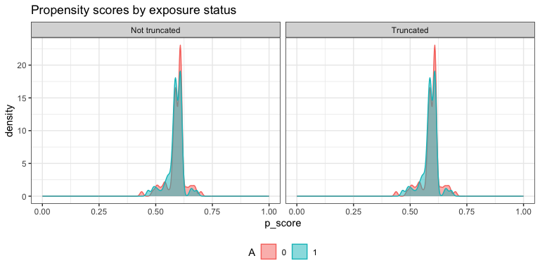

AIPW: Augmented Inverse Probability Weighting
================

<!-- badges: start -->

[](https://www.repostatus.org/#active)
[](https://www.tidyverse.org/lifecycle/#maturing)
[](https://codecov.io/gh/yqzhong7/AIPW?branch=master)
[](https://travis-ci.com/yqzhong7/AIPW)
[](https://github.com/yqzhong7/AIPW/actions)

<!-- badges: end -->
<!-- README.md is generated from README.Rmd. Please edit that file -->

**Contributors:** [Yongqi Zhong](https://github.com/yqzhong7), [Ashley
Naimi](https://github.com/ainaimi), [Gabriel
Conzuelo](https://github.com/gconzuelo), [Edward
Kennedy](https://github.com/ehkennedy)

------------------------------------------------------------------------

Augmented inverse probability weighting (AIPW) is a doubly robust
estimator for causal inference. The `AIPW` package is designed for
estimating the average treatment effect of a binary exposure on risk
difference (RD), risk ratio (RR) and odds ratio (OR) scales with
user-defined stacked machine learning algorithms
([SuperLearner](https://cran.r-project.org/web/packages/SuperLearner/index.html)
or [sl3](https://tlverse.org/sl3/index.html)). Users need to examine
causal assumptions (e.g., consistency) before using this package.

------------------------------------------------------------------------

## Contents:

-   ##### [Installation](#Installation)

-   ##### [Example](#Example)

    -   ###### [Setup example data](#data)

    -   ###### [One line version](#one_line)

-   ##### [Parallelization and progress bar](#par)

-   ##### [Use tmle/tmle3 as input](#tmle)

-   ##### [References](#ref)

------------------------------------------------------------------------

## <a id="Installation"></a>Installation

``` r
install.packages("remotes")
remotes::install_github("yqzhong7/AIPW")
```

## <a id="Example"></a>Example

### <a id="data"></a>Setup example data

``` r
set.seed(123)
data("eager_sim_obs")
outcome <- eager_sim_obs$sim_A
exposure <- eager_sim_obs$sim_Y
#covariates for both outcome model (Q) and exposure model (g)
covariates <- as.matrix(eager_sim_obs[-1:-2])

# covariates <- c(rbinom(N,1,0.4)) #a vector of a single covariate is also supported
```

### <a id="one_line"></a>One line version (`AIPW` class: method chaining from R6class)

``` r
library(AIPW)
library(SuperLearner)
#> Loading required package: nnls
#> Super Learner
#> Version: 2.0-26
#> Package created on 2019-10-27
library(ggplot2)
AIPW_SL <- AIPW$new(Y = outcome,
                    A = exposure,
                    W = covariates, 
                    Q.SL.library = c("SL.mean","SL.glm"),
                    g.SL.library = c("SL.mean","SL.glm"),
                    k_split = 3,
                    verbose=FALSE)$
  fit()$
  #Default truncation is set to 0.025; using 0.25 here is for illustrative purposes and not recommended
  summary(g.bound = 0.25)$ 
  plot.p_score()
```

<!-- -->

To see the results, set `verbose = TRUE`(default) or:

``` r
print(AIPW_SL$result, digits = 2)
#>                  Estimate    SE 95% LCL 95% UCL   N
#> Risk of exposure     0.68 0.053  0.5714    0.78  78
#> Risk of control      0.54 0.047  0.4536    0.64 122
#> Risk Difference      0.13 0.071 -0.0081    0.27 200
#> Risk Ratio           1.24 0.117  0.9860    1.56 200
#> Odds Ratio           1.74 0.310  0.9494    3.20 200
```

You can also use the `aipw_wrapper()` to wrap `new()`, `fit()` and
`summary()` together (also support method chaining):

``` r
AIPW_SL <- aipw_wrapper(Y = outcome,
                        A = exposure,
                        W = covariates, 
                        Q.SL.library = c("SL.mean","SL.glm"),
                        g.SL.library = c("SL.mean","SL.glm"),
                        k_split = 3,
                        verbose=TRUE)$plot.p_score()
```

## <a id="par"></a>Parallelization with `future.apply` and progress bar with `progressr`

In default setting, the `AIPW$fit()` method will be run sequentially.
The current version of AIPW package supports parallel processing
implemented by
[future.apply](https://github.com/HenrikBengtsson/future.apply) package
under the [future](https://github.com/HenrikBengtsson/future) framework.
Simply use `future::plan()` to enable parallelization and `set.seed()`
to take care of the random number generation (RNG) problem:

``` r
###Additional steps for parallel processing###
# install.packages("future.apply")
library(future.apply)
#> Loading required package: future
future::plan(multiprocess, workers=2, gc=T)
#> Warning: [ONE-TIME WARNING] Forked processing ('multicore') is disabled
#> in future (>= 1.13.0) when running R from RStudio, because it is
#> considered unstable. Because of this, plan("multicore") will fall
#> back to plan("sequential"), and plan("multiprocess") will fall back to
#> plan("multisession") - not plan("multicore") as in the past. For more details,
#> how to control forked processing or not, and how to silence this warning in
#> future R sessions, see ?future::supportsMulticore
set.seed(888)

###Same procedure for AIPW as described above###
AIPW_SL <- AIPW$new(Y = outcome,
                    A = exposure,
                    W = covariates, 
                    Q.SL.library = c("SL.mean","SL.glm"),
                    g.SL.library = c("SL.mean","SL.glm"),
                    k_split = 3,
                    verbose=TRUE)$fit()$summary()
#> Done!
#>                  Estimate     SE  95% LCL 95% UCL   N
#> Risk of exposure    0.676 0.0546  0.56913   0.783  78
#> Risk of control     0.538 0.0462  0.44705   0.628 122
#> Risk Difference     0.139 0.0714 -0.00144   0.279 200
#> Risk Ratio          1.258 0.1177  0.99869   1.584 200
#> Odds Ratio          1.796 0.3104  0.97745   3.300 200
```

Progress bar that supports parallel processing is available in the
`AIPW$fit()` method through the API from
[progressr](https://github.com/HenrikBengtsson/progressr) package:

``` r
library(progressr)
#define the type of progress bar
handlers("progress")
#reporting through progressr::with_progress() which is embedded in the AIPW$fit() method
with_progress(
  AIPW_SL <- AIPW$new(Y = outcome,
                    A = exposure,
                    W = covariates, 
                    Q.SL.library = c("SL.mean","SL.glm"),
                    g.SL.library = c("SL.mean","SL.glm"),
                    k_split = 3,
                    verbose=FALSE)$fit()$summary()
)
#also available for the wrapper
with_progress(
  AIPW_SL <- aipw_wrapper(Y = outcome,
                        A = exposure,
                        W = covariates, 
                        Q.SL.library = c("SL.mean","SL.glm"),
                        g.SL.library = c("SL.mean","SL.glm"),
                        k_split = 3,
                        verbose=FALSE)
)
```

## <a id="tmle"></a>Use `tmle`/`tmle3` fitted object as input (`AIPW_tmle` class)

`AIPW_tmle` class is designed for using `tmle`/`tmle3` fitted object as
input

#### 1. `tmle`

``` r
require(tmle)
#> Loading required package: tmle
#> Loading required package: glmnet
#> Loading required package: Matrix
#> Loaded glmnet 4.0
#> Welcome to the tmle package, version 1.4.0.1
#> 
#> Use tmleNews() to see details on changes and bug fixes
require(SuperLearner)
tmle_fit <- tmle(Y = outcome, A = exposure,W = covariates,
                 Q.SL.library=c("SL.mean","SL.glm"),
                 g.SL.library=c("SL.mean","SL.glm"),
                 family="binomial")
AIPW_tmle$
  new(A=exposure,Y=outcome,tmle_fit = tmle_fit,verbose = TRUE)$
  summary(g.bound=0.025)
#> Cross-fitting is supported only within the outcome model from a fitted tmle object (with cvQinit = TRUE)
#>                  Estimate     SE 95% LCL 95% UCL   N
#> Risk of exposure    0.678 0.0529 0.57380   0.781  78
#> Risk of control     0.534 0.0455 0.44450   0.623 122
#> Risk Difference     0.144 0.0698 0.00702   0.281 200
#> Risk Ratio          1.270 0.1157 1.01198   1.593 200
#> Odds Ratio          1.836 0.3037 1.01244   3.330 200
```

#### 2. `tmle3`

``` r
library(sl3)
library(tmle3)
node_list <- list(A = "sim_A",Y = "sim_Y",W = colnames(eager_sim_obs)[-1:-2])
or_spec <- tmle_OR(baseline_level = "0",contrast_level = "1")
tmle_task <- or_spec$make_tmle_task(eager_sim_obs,node_list)
lrnr_glm <- make_learner(Lrnr_glm)
lrnr_mean <- make_learner(Lrnr_mean)
sl <- Lrnr_sl$new(learners = list(lrnr_glm,lrnr_mean))
learner_list <- list(A = sl, Y = sl)
tmle3_fit <- tmle3(or_spec, data=eager_sim_obs, node_list, learner_list)

# parse tmle3_fit into AIPW_tmle class
AIPW_tmle$
  new(A=eager_sim_obs$sim_A,Y=eager_sim_obs$sim_Y,tmle_fit = tmle3_fit,verbose = TRUE)$
  summary()
```

------------------------------------------------------------------------

### <a id="ref"></a>References:

Robins, J.M., Rotnitzky, A. and Zhao, L.P., 1994. Estimation of
regression coefficients when some regressors are not always observed.
Journal of the American statistical Association, 89(427), pp.846-866.

Glynn, A.N. and Quinn, K.M., 2010. An introduction to the augmented
inverse propensity weighted estimator. Political analysis, 18(1),
pp.36-56.

Pearl, J., 2009. Causality. Cambridge university press.
